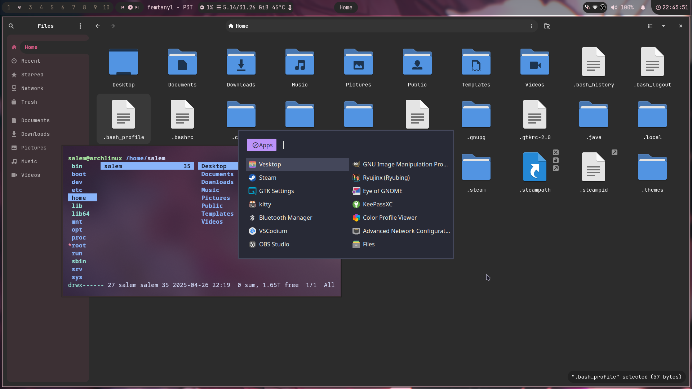

### My not so minimal dotfiles for Hyprland

Thanks to [LinuxMobile](https://github.com/linuxmobile) for the base config. \
Thanks to [Catppuccin](https://github.com/catppuccin) for the amazing themes.

### Dependencies

```
paru -S hyprland hyprlock waybar swww slurp grim wl-clipboard rofi swaync nwg-look ttf-jetbrains-mono-nerd papirus-icon-theme rose-pine-cursor starship nushell btop ranger vim kitty && rm -rf ~/paru
```

my personal pick (sorta optional)
```
paru -S xorg-xwayland qt5-wayland qt6-wayland gvfs gvfs-mtp mtpfs xdg-user-dirs networkmanager bluez bluez-utils blueman pavucontrol vlc ffmpeg amberol steam gimp eog obs-studio vesktop-bin zen-browser-bin vscodium-bin keepassxc flatpak nautilus neofetch noto-fonts-cjk noto-fonts-emoji noto-fonts-extra 
```

| Title                            | Showcase Image                |
|---------------------------------|--------------------------------|
| **File manager & rofi**         |   |
| **Music & Browser**             |   |
| **OBS & Vscodium**              |   |
| **Home Screen + swaync**        |   |
