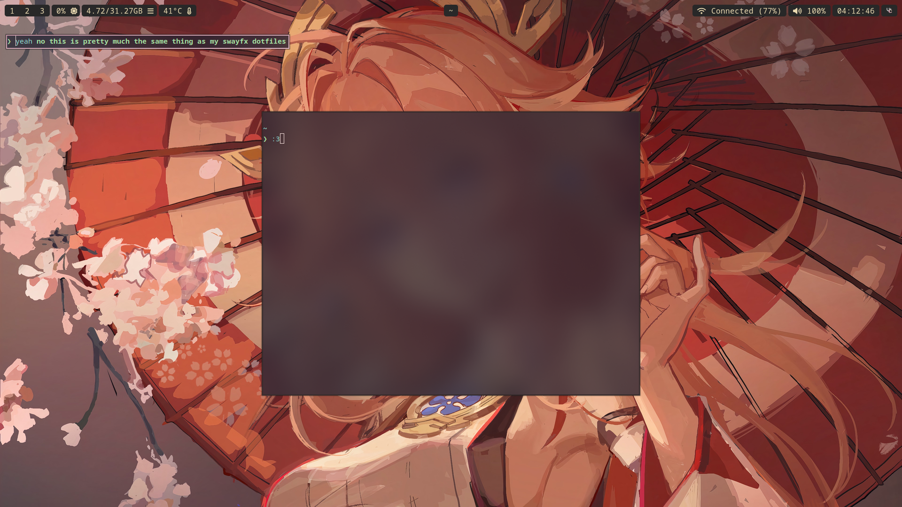

### Salem's not so minimal dotfiles for Hyprland

a lot of this config is thanks to 
https://github.com/linuxmobile

### Steps

```
git clone https://github.com/rott1ngC0rpse/hyprland-dotfiles.git
```

```
git clone https://aur.archlinux.org/paru && cd paru && makepkg -si
```

```
paru -S rofi waybar hyprlock ttf-jetbrains-mono-nerd hyprland swww starship slurp rose-pine-cursor ranger vim mako nusehll grim alacritty arc-gtk-theme papirus-icon-theme wf-recorder wl-clipboard nwg-look && rm -rf ~/paru
```

my personal pick (optional)
```
paru -S vesktop pcmanfm-gtk3 mtpfs mullvad-browser bluez bluez-utils fastfetch gvfs gvfs-mtp keepassxc networkmanager steam xdg-user-dirs xorg-xwayland noto-fonts-cjk noto-fonts-emoji-noto-fonts-extra flatpak eog mpv ffmpeg cmus btop
```



