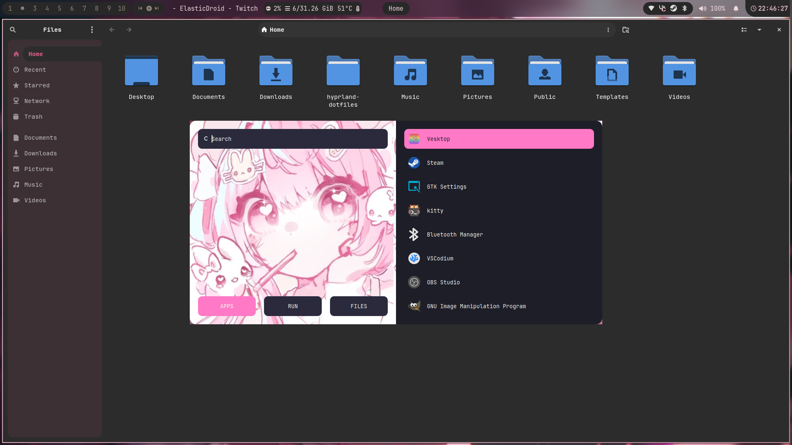

### My not so minimal dotfiles for Hyprland

Thanks to [LinuxMobile](https://github.com/linuxmobile) for the base config. \
Thanks to [Catppuccin](https://github.com/catppuccin) for the amazing themes. \
Thanks to [Adi1090x](https://github.com/adi1090x/rofi/) for the incredible rofi config. \
Thanks to [forkentine](https://github.com/forkentine) for the beautiful swaync config.

### Dependencies

```
paru -S hyprland hyprlock sddm sddm-theme-catppuccin waybar-cava swww slurp grim wl-clipboard rofi swaync nwg-look ttf-jetbrains-mono-nerd papirus-icon-theme rose-pine-cursor starship nushell mission-center ranger vim kitty && rm -rf ~/paru
```

my personal pick (sorta optional)
```
paru -S xorg-xwayland qt5-wayland qt6-wayland gvfs gvfs-mtp mtpfs xdg-user-dirs networkmanager network-manager-applet bluez bluez-utils blueman pavucontrol vlc ffmpeg amberol steam gimp eog obs-studio vesktop-bin zen-browser-bin vscodium-bin keepassxc flatpak nautilus neofetch noto-fonts-cjk noto-fonts-emoji noto-fonts-extra 
```

Keep in mind that my dotfiles are designed for my use case, some features may not be to your liking.

| Title                     | Showcase Image                 |
|---------------------------|--------------------------------|
| **Home & Swaync**         |   |
| **Nautilus & Rofi**       | |
| **Zen & Amberol**         |   |
| **Vscodium & OBS**        |   |
| **Waybar**                |   |
