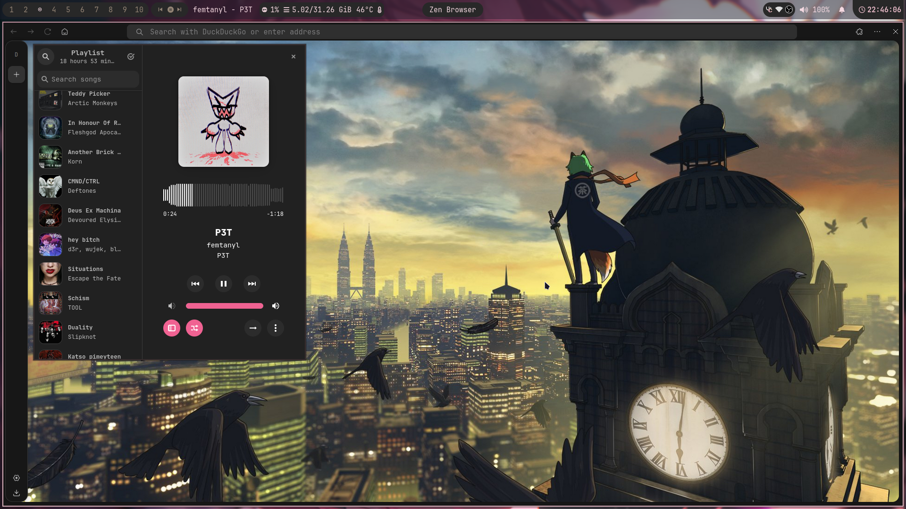

### My not so minimal dotfiles for Hyprland

Thanks to (https://github.com/linuxmobile)[LinuxMobile] for the base config.

### Steps

```
git clone https://github.com/rott1ngc0rpse/hyprland-dotfiles/
```

```
git clone https://aur.archlinux.org/paru && cd paru && makepkg -si
```

```
paru -S rofi waybar hyprlock ttf-jetbrains-mono-nerd hyprland swww starship slurp rose-pine-cursor ranger vim swaync nushell grim btop kitty arc-gtk-theme papirus-icon-theme wl-clipboard nwg-look nwg-bar && rm -rf ~/paru
```

my personal pick (sorta optional)
```
paru -S vesktop-bin nautilus mtpfs zen-browser-bin bluez bluez-utils blueman pavucontrol gimp neofetch gvfs gvfs-mtp keepassxc networkmanager steam xdg-user-dirs xorg-xwayland qt5-wayland qt6-wayland noto-fonts-cjk noto-fonts-emoji noto-fonts-extra flatpak eog vlc ffmpeg vscodium-bin obs-studio amberol
```

| Title                            | Showcase Image                |
|---------------------------------|--------------------------------|
| **File manager & rofi**         |   |
| **Music & Browser**             |   |
| **OBS & Vscodium**              |   |
| **Home Screen + swaync**        |   |


